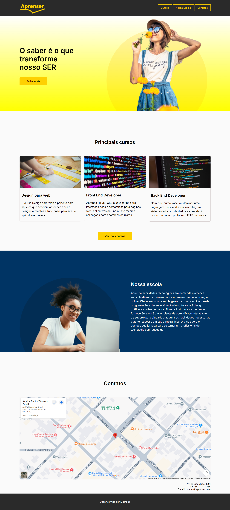

# 🎓 Aprenser — Landing Page

Projeto de landing page para uma escola de tecnologia online, desenvolvido com foco em estruturação semântica, organização de layout e boas práticas de CSS.

## 🎯 Objetivo

Simular uma página real de apresentação de uma escola de cursos online, praticando conceitos de HTML semântico, CSS moderno e organização de componentes visuais.

## 🛠️ Tecnologias utilizadas

- HTML5
- CSS3
- Google Fonts (Inter)
- CSS Variables
- Flexbox
- Google Maps Embed API

## 📌 Seções da página

- **Header fixo** com navegação e logo
- **Hero Banner** com chamada principal e imagem
- **Principais Cursos** com cards informativos
- **Nossa Escola** com apresentação institucional
- **Contatos** com mapa e endereço
- **Footer** com créditos

## 🌐 Acesse o projeto

👉 [Clique aqui para ver ao vivo](https://devbymatheus.github.io/Projeto-Aprenser/)

## 📸 Preview

## 🔗 Repositório

https://github.com/devbymatheus/aprenser

## 📚 Sobre

Este projeto faz parte da minha jornada de aprendizado em desenvolvimento web, focando na construção de interfaces modernas e evolução prática no front-end.

